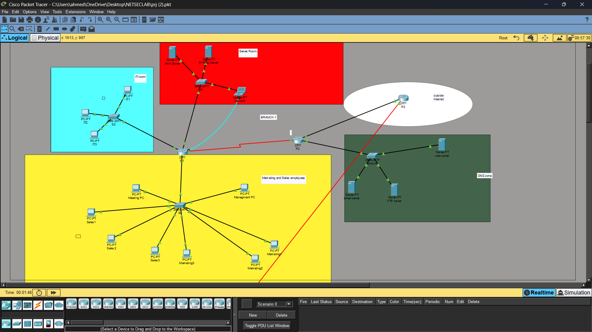
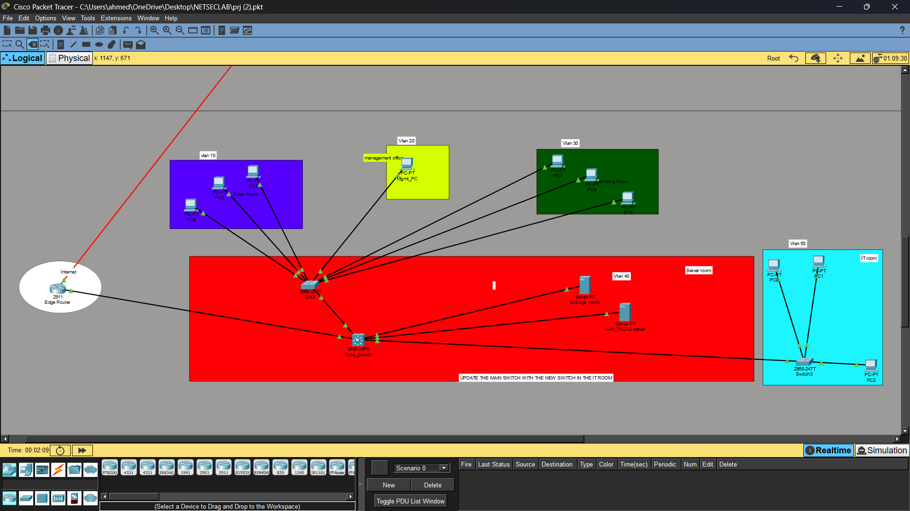

# Enterprise Network Security using Cisco Packet Tracer

> A secure multi-branch enterprise network designed and implemented in Cisco Packet Tracer, featuring OSPF dynamic routing, VLAN segmentation, Site-to-Site IPsec VPN, centralized authentication, network monitoring, and layered security controls.

---

## Overview

This project demonstrates the design and implementation of a secure enterprise network connecting two organizational branches over a simulated public network.

The network was designed to provide secure communication, scalable routing, centralized administration, and infrastructure monitoring while following enterprise networking best practices. The implementation combines Cisco routing, switching, authentication, VPN technologies, and multiple security mechanisms to simulate a realistic enterprise environment.

---

# Technologies Used

| Category | Technologies |
|-----------|--------------|
| Network Simulation | Cisco Packet Tracer |
| Routing | OSPF |
| Switching | VLANs, Trunking |
| Inter-VLAN Routing | Router-on-a-Stick |
| VPN | Site-to-Site IPsec VPN |
| Authentication | TACACS+ AAA |
| Monitoring | Syslog |
| Security | ACLs, Cisco IOS IPS, Port Security |
| Remote Management | SSH |

---

# Key Features

- Multi-branch enterprise network
- OSPF dynamic routing
- VLAN segmentation
- Router-on-a-Stick Inter-VLAN routing
- Site-to-Site IPsec VPN
- TACACS+ centralized authentication
- Centralized Syslog logging
- Access Control Lists (ACLs)
- Cisco IOS Intrusion Prevention System (IPS)
- Layer 2 Port Security
- Secure SSH administration
- Device hardening and password encryption

---

# Network Architecture

The enterprise network is composed of two interconnected sites linked through a secure Site-to-Site IPsec VPN.

- **Headquarters (Branch 1)** hosts the organization's core infrastructure, including enterprise servers, the DMZ, TACACS+ AAA server, Syslog server, and core routing infrastructure.
- **Branch Office (Branch 2)** contains departmental VLANs connected securely to the headquarters through the VPN.
- **OSPF** provides dynamic routing between both locations.
- **Layered security controls** protect network infrastructure, user access, and inter-branch communication.

---

# Network Topology

## Headquarters (Branch 1)

<p align="center">
    
</p>

The headquarters hosts the enterprise servers, centralized authentication services, monitoring infrastructure, and perimeter security components that support the entire organization.

---

## Branch Office (Branch 2)

<p align="center">
    
</p>

The branch office contains departmental VLANs connected to the headquarters through an encrypted Site-to-Site IPsec VPN while using OSPF to dynamically exchange routing information.

---

# Security Features

| Security Feature | Purpose |
|------------------|---------|
| **TACACS+ AAA** | Centralized administrator authentication |
| **Site-to-Site IPsec VPN** | Secure encrypted communication between both branches |
| **Access Control Lists (ACLs)** | Restrict unauthorized traffic and enforce security policies |
| **Cisco IOS IPS** | Detect and mitigate malicious network activity |
| **Syslog** | Centralized logging, auditing, and troubleshooting |
| **Port Security** | Prevent unauthorized devices from connecting to access switches |
| **SSH** | Secure remote administration |
| **Device Hardening** | Password encryption and login protection |

---

# Skills Demonstrated

### Enterprise Networking

- Enterprise Network Design
- Cisco Router Configuration
- Cisco Switch Configuration
- Network Segmentation
- IP Address Planning

### Routing & Switching

- OSPF Dynamic Routing
- VLAN Configuration
- Trunking
- Router-on-a-Stick
- Network Troubleshooting

### Network Security

- Defense-in-Depth
- TACACS+ AAA
- Access Control Lists
- Cisco IOS IPS
- Port Security
- Device Hardening

### Secure Communications

- Site-to-Site IPsec VPN
- SSH Administration

### Monitoring

- Syslog
- Network Verification
- Infrastructure Monitoring

---

# Repository Structure

```text
enterprise-network-security-packet-tracer/
│
├── Enterprise-Network.pkt
├── README.md
│
├── docs/
│   ├── Milestone1_Report.pdf
│   └── Milestone2_Report.pdf
│
└── images/
    ├── branch1-topology.png
    └── branch2-topology.png
```

---

# Documentation

Additional technical documentation describing the network design, implementation process, verification procedures, and security configuration is available in the **docs/** directory.

---

# Future Improvements

Potential future enhancements include:

- IPv6 deployment
- High Availability (HSRP/VRRP)
- Firewall integration
- Network automation using Python and Ansible

---

# How to Run

1. Install **Cisco Packet Tracer 8.x** or later.
2. Clone this repository.

```bash
git clone https://github.com/AhmedHebesha/enterprise-network-security-packet-tracer.git
```

3. Open `Enterprise-Network.pkt` using Cisco Packet Tracer.
4. Explore the topology, verify routing, and inspect the implemented security configurations.

---

# Author

**Ahmed Wael Hebesha**
---
